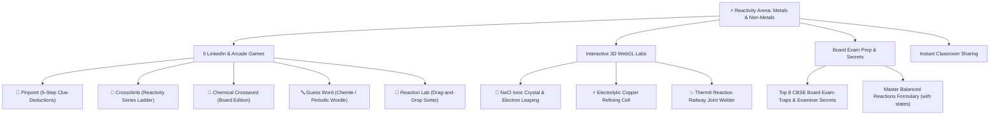

# ⚡ Reactivity Arena: Metals and Non-Metals
> **Interactive 3D WebGL Arcade &bull; CBSE Class 10 Science (Chapter 3) &bull; Gamified Board Exam Prep**

<p align="center">
  
  <br />
  <strong>📱 Scan with your smartphone camera to launch the 3D Arcade!</strong>
  <br /><br />
  <a href="https://hazardous9hub.github.io/reactivity-arena/">
    
  </a>
</p>

<p align="center">
  
  
  
  
  
  
  
  
</p>

---

## 🌟 Available Links & Access

- 🚀 **Official Live Web Application**: **[https://hazardous9hub.github.io/reactivity-arena/](https://hazardous9hub.github.io/reactivity-arena/)**
- 📄 **Printable Classroom QR Poster (300 DPI)**: [Download `Reactivity-Arena-Class10-Metals-QRCode.png`](./Reactivity-Arena-Class10-Metals-QRCode.png)
- 💻 **Local Development Server**: `http://localhost:5173/`

---

## 🎮 What Makes Reactivity Arena Special?

**Reactivity Arena: Metals and Non-Metals** transforms dense Class 10 chemistry theory into an addictive, visual, and tactile 3D experience. Inspired by LinkedIn's popular daily puzzles and educational interactives, students learn reactions, extraction processes, and exceptions by **playing**:



---

## 🕹️ Deep Dive: The 5 Interactive Game Engines

### 1. 🎯 Pinpoint (5-Step Clue Deductions)
- **Gameplay**: Inspired by LinkedIn Pinpoint. Students read progressive clues starting broad and narrowing to exact chemical entities (*Zinc, Cinnabar, Aqua Regia, Aluminium Oxide, Solder, Gallium, Thermit Reaction, Basic Copper Carbonate*).
- **Scoring**: Earn +500 PTS on Clue 1 down to +100 PTS on Clue 5.
- **Pedagogical Payoff**: Winning immediately displays the **CBSE Marking Scheme Key Concept**.

### 2. 🧗 Crossclimb (Reactivity Series Ladder)
- **Gameplay**: A vertical ladder climb where students position metals based on reaction violently with cold water, hot water, steam, or displacement strength ($\text{K} > \text{Na} > \text{Ca} > \text{Mg} > \text{Al} > \text{Zn} > \text{Fe} > \text{Pb} > [\text{H}] > \text{Cu} > \text{Hg} > \text{Ag} > \text{Au}$).
- **Visuals**: Animated metal rungs that illuminate with audio chimes upon correct placement.

### 3. 🧩 Chemical Crossword (Class 10 Board Edition)
- **Gameplay**: Interactive crossword grid packed with core NCERT vocabulary (*Solder, Steel, Ductile, Cinnabar, Roasting, Alloy, Thermit, Anode, Ionic*).
- **Features**: Auto-advancing cell inputs, clue highlighting, on-screen keyboard support, and a "💡 Reveal Letter" hint tool.

### 4. 🔤 Guess Word (Chemle / Periodic Wordle)
- **Gameplay**: 6 attempts to guess 5 and 6-letter chemistry words with color-coded feedback (Green = correct spot, Yellow = wrong spot, Gray = not in word).
- **Virtual Keyboard**: Touch-friendly QWERTY keyboard with dynamic color tracking.
- **Board Fact Card**: Explains how each term is tested in board exams.

### 5. 🧪 Reaction Lab (Wordwall & SciChamp Inspired)
- **Gameplay**: Drag-and-drop or tap-to-place category sorting arena:
  - *Water Reactivity*: Cold Water vs Hot Water vs Steam vs No Reaction.
  - *Metallurgy*: Roasting (sulphide ores in excess $\text{O}_2$) vs Calcination (carbonate ores in limited $\text{O}_2$) vs Electrolysis (molten salts).
  - *Displacement Showdown*: Reaction occurs vs No reaction.

---

## 🔬 Interactive 3D WebGL Laboratory (Three.js)

1. **🔬 NaCl Ionic Crystal & Electron Leaping**:
   - $3 \times 3 \times 3$ alternating rock-salt lattice of violet $\text{Na}^+$ and emerald $\text{Cl}^-$ ions with dynamic bonds.
   - Animated electron trajectory leaping from Sodium ($2,8,1$) to Chlorine ($2,8,7$) along a 3D Bezier curve.
2. **⚡ Electrolytic Copper Refining Cell**:
   - Transparent glass electrolyte cell filled with blue acidified $\text{CuSO}_4$ solution.
   - Impure copper anode, thin pure copper cathode, moving $\text{Cu}^{2+}$ ions, and settling anode mud ($\text{Ag, Au}$).
3. **💥 Thermit Reaction Railway Joint Welder**:
   - Conical refractory crucible mounted over split steel railway tracks.
   - Showering exothermic sparks and glowing molten liquid iron ($2\text{Fe(l)}$) filling the track gap.

---

## 🚀 Technical Highlights & Stack

| Technology | Role & Implementation |
| :--- | :--- |
| **Three.js + WebGL** | PBR materials, custom lighting, particle systems, 60fps render loop with DPR throttling. |
| **Lenis Smooth Scroll** | Butter-smooth inertial scrolling synchronized across mouse wheel and touch gestures. |
| **GSAP & ScrollTrigger** | High-performance timeline animations and scroll-bound entrance transitions. |
| **Web Audio API** | Pure procedural sound synthesizer (click, correct chord, error buzz, victory fanfare) &mdash; zero external MP3s to load. |
| **PWA & Manifest** | Installable directly to phone home screens on iOS & Android for offline studying. |
| **GitHub Actions** | Automated CI/CD pipeline building Vite and publishing to GitHub Pages on push. |

---

## 💻 Local Development Setup

To run Reactivity Arena locally:

```bash
# 1. Clone the repository
git clone https://github.com/Hazardous9hub/reactivity-arena.git
cd reactivity-arena

# 2. Install dependencies
npm install

# 3. Start local development server
npm run dev

# 4. Build production bundle
npm run build
```

---

<br />

<div align="center">

### 💖 A Special Classroom Dedication

> *“Crafted with boundless love and care for **Pooja** and her brilliant students preparing for their **Class 10 CBSE Science Board Examinations**.*  
>  
> *May this interactive 3D playground take the fear out of chemical equations, reactivity series, and metallurgy, turning every study session into an adventure of curiosity, play, and complete confidence.*  
>  
> *Study with joy, aim for that 100/100, and never stop exploring!”*

<p>
  <strong>🌟 From your loving brother &bull; Built with pair programming on Antigravity 🌟</strong>
</p>

</div>
