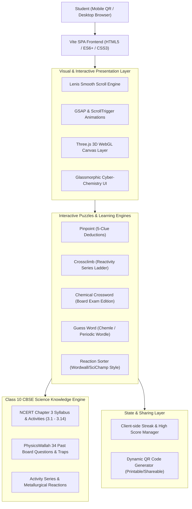

# System Architecture & Tech Stack: Alchemix 3D

## 1. High-Level Architecture Overview



---

## 2. Technology Stack Selection

| Component | Selected Technology | Rationale |
| :--- | :--- | :--- |
| **Build Tool & Runtime** | **Vite + Vanilla ES Modules / Modern JS** | Zero-latency HMR, lightweight bundle size, instant startup, optimal for 60fps mobile WebGL without framework overhead. |
| **3D & WebGL Graphics** | **Three.js** | Industry standard for browser 3D graphics, PBR metallic materials, custom shaders, and particle effects. |
| **Smooth Scrolling** | **@studio-freight/lenis** | Lightweight, buttery 60fps smooth scrolling synchronized with mobile touch & desktop wheel. |
| **Animations & FX** | **GSAP (GreenSock) + ScrollTrigger + Canvas Confetti** | High performance timeline animations, scroll-bound 3D camera transitions, and celebratory particle rewards. |
| **Styling System** | **Tailwind CSS + Custom CSS Variables** | Rapid responsive design, glowing neon chemistry accents, glassmorphic HUD overlays, and mobile touch targets ($\ge 48\text{px}$). |
| **QR Code Engine** | **qrcode / qrcodejs** | Generates SVG/Canvas QR codes client-side for immediate classroom projection or physical worksheet printing. |
| **Sound Synthesis** | **Web Audio API (Synthesized SFX)** | Zero external audio asset loading delays; instant bleeps, chimes, and victory fanfares via programmatic oscillators. |

---

## 3. Directory Structure

```text
Metals Non Metals/
├── docs/
│   ├── PRD.md                  # Product requirements & user stories
│   ├── ARCHITECTURE.md         # System design & tech choices
│   ├── DESIGN.md               # Theme, palette, typography & sound specs
│   ├── RULES.md                # Development standards & board syllabus integrity
│   ├── TASKS.md                # Phased development checklist
│   ├── TEST_PLAN.md            # Testing scenarios & QA checklist
│   └── MEMORY.md               # Live project state & progress
├── public/
│   ├── favicon.svg             # Animated chemistry flask icon
│   └── models/                 # 3D assets or procedural geometry configs
├── src/
│   ├── components/
│   │   ├── Header.js           # Animated logo & navigation HUD
│   │   ├── QRModal.js          # QR code generator modal with print/download
│   │   ├── Scoreboard.js       # Student progress, badges & streak counter
│   │   └── SoundController.js  # Web Audio API sound FX controller
│   ├── data/
│   │   ├── chemicalReactions.js# All balanced board reactions & conditions
│   │   ├── crosswordClues.js   # Board exam crossword puzzles
│   │   ├── pinpointQuestions.js# 5-step clue deduction challenges
│   │   ├── reactivityLadder.js # Crossclimb reactivity trivia sets
│   │   ├── guessWords.js       # 5 & 6-letter chemistry vocabulary
│   │   └── ncertActivities.js  # Simulated experiments (3.1 to 3.14)
│   ├── games/
│   │   ├── PinpointGame.js     # 5-Clue Deductions engine
│   │   ├── CrossclimbGame.js   # Reactivity series ladder engine
│   │   ├── CrosswordGame.js    # Interactive crossword matrix
│   │   ├── GuessWordGame.js    # Chemle wordle-style game
│   │   └── ReactionLabGame.js  # Drag-and-drop sort & balance arena
│   ├── three/
│   │   ├── SceneManager.js     # Three.js canvas setup, camera, lighting
│   │   ├── AtomLattice.js      # 3D ionic transfer & crystal lattice
│   │   ├── RefiningCell.js     # 3D electrolytic copper refining tank
│   │   └── ThermitSim.js       # 3D exothermic reaction particle sim
│   ├── styles/
│   │   ├── main.css            # Global theme & typography
│   │   └── games.css           # Puzzle grids & interactive animations
│   ├── main.js                 # App bootloader, Lenis + GSAP initialization
│   └── index.html              # App entrypoint
├── index.html                  # Root landing page for direct preview
├── package.json
└── vite.config.js
```

---

## 4. Architectural Principles
1. **Frictionless Mobile-First Experience**: When a student scans the QR code, the page must boot within 1 second on mobile networks without requiring login or app installation.
2. **Pedagogical Accuracy**: Every chemical equation, state symbol, color change (e.g. blue $\text{CuSO}_4 \to$ greenish $\text{FeSO}_4$, black $\text{Ag}_2\text{S}$, green basic copper carbonate), and board exception must strictly adhere to the NCERT Class 10 curriculum.
3. **Decoupled Game Engines**: Each puzzle game is an independent class with a unified lifecycle (`init()`, `start()`, `checkAnswer()`, `reset()`, `getScore()`).
4. **Resilient Offline-Ready Operation**: All question banks, 3D procedural geometries, and audio effects reside locally in client bundles with zero external API dependencies.
